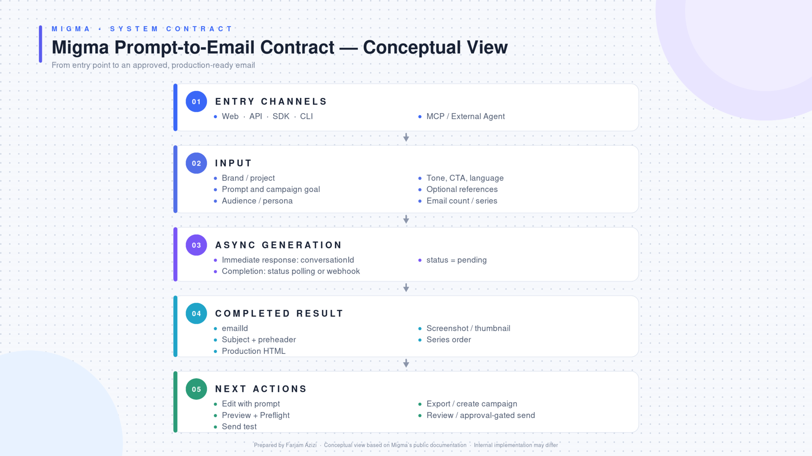
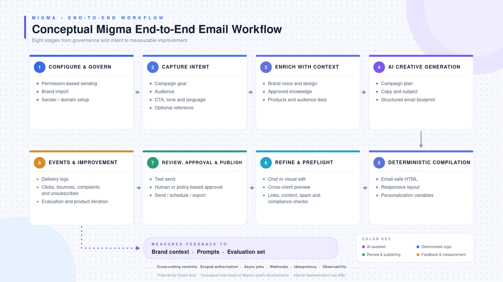

# Migma conceptual diagrams

This project generates two 16:9, presentation-ready diagrams:

1. **Migma Prompt-to-Email Contract — Conceptual View**
2. **Conceptual Migma End-to-End Email Workflow**

The SVG renderer uses only the Python standard library. SVG files are ideal for
PowerPoint, Keynote, Google Slides, Figma, and browser viewing because they
remain sharp at any scale. PNG export uses ImageMagick when it is available.
The default run also combines both slides into a presentation-ready PDF.

## Combined submission PDF

[Open the two-page PDF](output/Farjam_Azizi_Migma_Conceptual_Email_Workflow.pdf)

## Diagram previews

### 1. Migma Prompt-to-Email Contract — Conceptual View



Output files:

- [Open the PNG](output/migma_prompt_to_email_contract.png)
- [Open the scalable SVG](output/migma_prompt_to_email_contract.svg)

### 2. Conceptual Migma End-to-End Email Workflow



Output files:

- [Open the PNG](output/migma_end_to_end_email_workflow.png)
- [Open the scalable SVG](output/migma_end_to_end_email_workflow.svg)

## Run

```bash
/home/farjam/miniconda3/envs/draw_diagram_migma/bin/python \
  draw_diagrams.py --format both
```

Generated files are written to `output/`:

```text
output/
├── Farjam_Azizi_Migma_Conceptual_Email_Workflow.pdf
├── migma_prompt_to_email_contract.png
├── migma_prompt_to_email_contract.svg
├── migma_end_to_end_email_workflow.png
└── migma_end_to_end_email_workflow.svg
```

Other options:

```bash
python draw_diagrams.py --format svg
python draw_diagrams.py --format png --output-dir build
```
